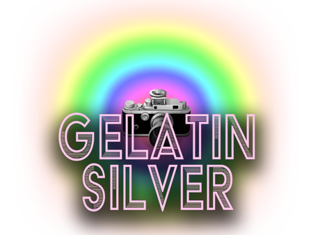
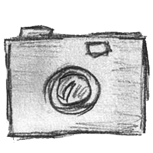
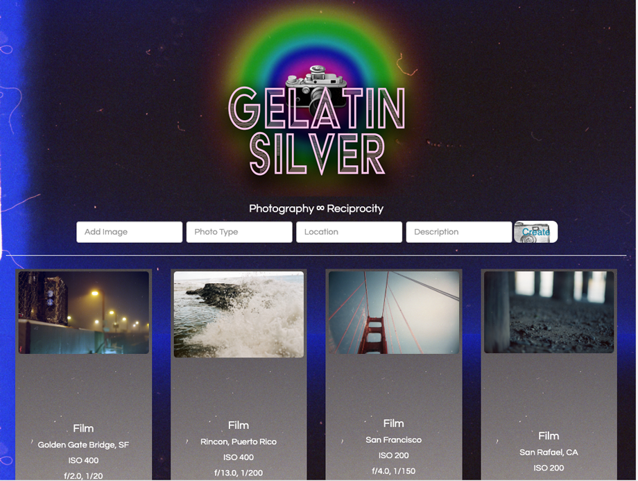

</img>

## GELATIN SILVER:

**Making things for Visual Phototransduction in the Retinal Mosiac**

 
A collection of captured photographic reciprocity.
 
An analogue recording of photons frozen in time for the visual photo transduction happening in the retinal mosaic wall.

 

---

Gelatin Silver is a repository of analogue photographs, including a detailed inventory of each photos settings.

 

##  About Gelatin Silver
The **_Gelatin Silver Process_** is one of the earliest forms of developing images on light-sensitive paper. 
Before a paper is exposed, the image layer is a clear gelatin matrix holding the light-sensitive silver halides. -  
[Technology](https://en.wikipedia.org/wiki/Gelatin_silver_process#Technology)
|
[Unionpedia](https://en.unionpedia.org/Gelatin_silver_process) | [History](https://smarthistory.org/the-gelatin-silver-process-10-of-12/)

 

> .. gelatin silver printing is an example of "latent" printing, in which an image is activated by light, but is not revealed until submerged in a developer solution. In this case, a negative image is projected onto paper treated with light-sensitive chemicals: silver halide suspended in gelatin (a viscous liquid made from animal collagen). A series of chemical baths will subsequently reveal the latent image, halt the development, remove its sensitivity to light, and fine-tune contrast.

- [Artspace on Gelatin Silver Processing](https://www.artspace.com/magazine/art_101/collecting-101/whats-a-chromogenic-pigment-or-gelatin-print-the-ultimate-guide-to-digital-and-chemical-photo-54752)

 

 

**_Though this mostly refers to B&W photography, it is possible to print in color..._**
 
 - [Silver Gelatin Colour](https://www.analoguelab.com.au/techniques-and-materials/silver-gelatin-colour/)
 

## Photographic Reciprocity Database: Settings Repository
An attempt to record and develop a better understanding of [reciprocity in photography.](https://www.picturecorrect.com/tips/understanding-reciprocity-in-photography/)
 

## Resources for Phototransduction
* [Visual Phototransduction](https://reactome.org/content/detail/R-HSA-2187338)
* [Photoreceptor Cells](https://en.wikipedia.org/wiki/Photoreceptor_cell)
* [The Reciprocity Rule](https://www.apogeephoto.com/the-reciprocity-rule-in-photography/)

## MX

</img>

 

<a href="https//mxnkpl.com/"> MXNKPL.COM</a> | <a href="https//mxnkpl.com/blog/" >BLOG </a>

