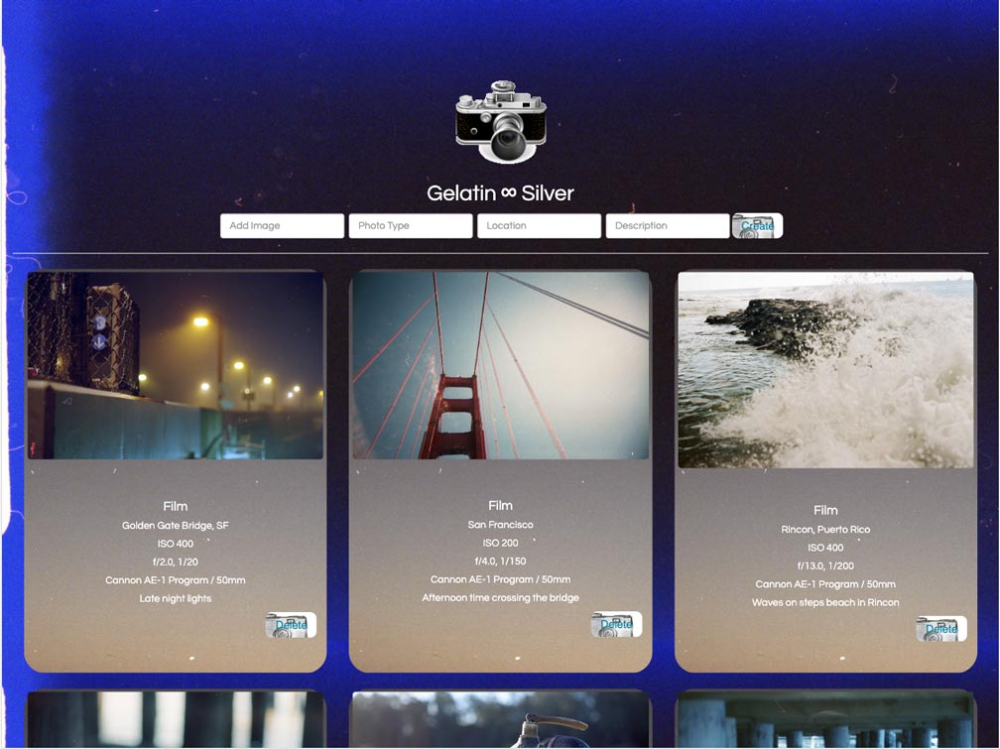

## GELATIN SILVER:
===================

**Making things for Visual Phototransduction in the Retinal Mosiac**

 
A collection of captured photographic reciprocity.
 
An analogue recording of photons frozen in time for the visual photo transduction happening in the retinal mosaic wall.

 

---

### [About Gelatin Silver](#about) | [Photographic Database](#photodatabase) | [Resources for Phototransduction](#phototransduction) | [Mx](#mx)

Gelatin Silver is a repository of analogue photographs, including a detailed inventory of each photos settings.

 

##  About Gelatin Silver
[#about]
The *Gelatin Silver Process* is one of the earliest forms of developing images on light-sensitive paper. 
Before a paper is exposed, the image layer is a clear gelatin matrix holding the light-sensitive silver halides. -  
[Technology](https://en.wikipedia.org/wiki/Gelatin_silver_process#Technology)
|
[Unionpedia](https://en.unionpedia.org/Gelatin_silver_process) | [History](https://smarthistory.org/the-gelatin-silver-process-10-of-12/)

 

## Photographic Reciprocity Database: Settings Repository
[#photodatabase]
An attempt to record and develop a better understanding of [reciprocity in photography.](https://www.picturecorrect.com/tips/understanding-reciprocity-in-photography/)
 

## Resources for Phototransduction
[#phototransduction]
* [Visual Phototransduction](https://reactome.org/content/detail/R-HSA-2187338)
* [Photoreceptor Cells](https://en.wikipedia.org/wiki/Photoreceptor_cell)
* [The Reciprocity Rule](https://www.apogeephoto.com/the-reciprocity-rule-in-photography/)

## Mx
[#mx]

 
[Max Nakpil](https//mxnkpl.com) | [Travel Log](https//mxnkpl.com/blog)

